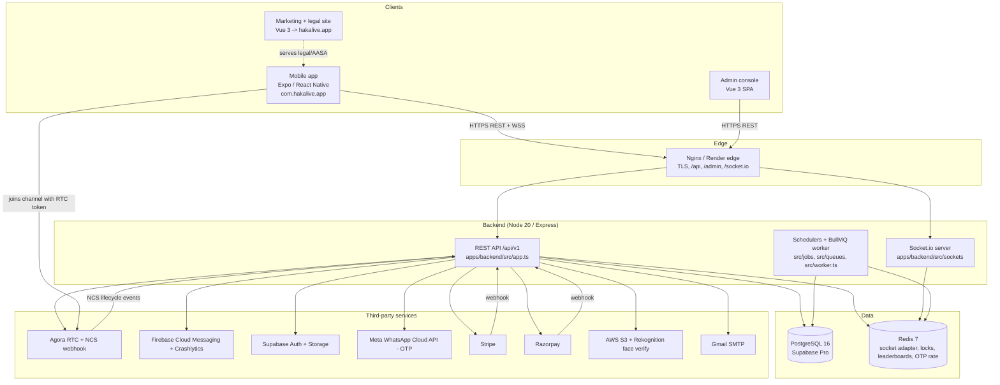

# Haka Live — System Architecture

All module paths below are real and verified against `apps/backend/src` on 2026-06-05.

## 1. Component diagram



Key structural facts:

- The **admin SPA is embedded in the backend image**. `apps/backend/src/app.ts` serves it from one of several
  candidate paths (`/admin-dist`, `dist/admin-dist`, `../admin/dist`, …) at `/admin` and falls back to `index.html`
  for client-side routing. The build step (`apps/backend/package.json` `build`) builds the admin app and copies
  `apps/admin/dist` into `apps/backend/admin-dist`, which the Dockerfile then embeds into `dist/admin-dist`.
- **Socket.io scales horizontally** via the Redis adapter (`@socket.io/redis-adapter`, see `apps/backend/src/sockets/index.ts`).
  This is why multiple API instances on Render can share room/DM events.
- **Schedulers** (leaderboard reset, FX currency sync, Special ID expiry, calculator cleanup, ban expiry) run inside
  the API process when `ENABLE_SCHEDULER=true` (default). On a horizontally scaled deploy you run a dedicated
  `worker` process (`npm run dev:worker` / `node dist/worker.js`) and set `ENABLE_SCHEDULER=false` on the API nodes
  to avoid duplicate cron. Redis locks de-dupe even if both run. PK matchmaking always runs on API nodes (needs sockets).

## 2. REST request flow

```
Mobile/Admin
  → HTTPS request with Authorization: Bearer <accessToken> (+ optional X-Device-Id)
  → Nginx/Render edge → Express (apps/backend/src/app.ts)
      → helmet + CORS (env.CORS_ORIGIN) + morgan
      → global rate limiter (keyed by JWT sub, else device id, else IP; 15-min window)
      → /api/v1/auth uses a stricter IP-keyed authLimiter
      → route module (apps/backend/src/modules/<feature>/<feature>.routes.ts)
          → authenticate middleware (src/middleware/auth.middleware.ts) verifies the access JWT
          → controller → service (DB via Prisma, cache/locks via Redis)
      → response envelope: { success, data, message } (src/utils/response.ts)
  → errorHandler (src/middleware/error.middleware.ts) maps AppError → status codes
```

Route map (mounted in `apps/backend/src/app.ts`):

```
/api/v1/auth         whatsapp-otp.routes + accounts.routes (login, refresh, OTP, devices)
/api/v1/users        /profile  /face-verification
/api/v1/rooms        /music    + normal-battle routes mounted under /rooms
/api/v1/chat         /wallet   /payroll-agent  /gifts  /levels  /family
/api/v1/payments     /leaderboard  /invites  /activity  /notifications
/api/v1/moderation   /host-application  /agency (+ agency-invitations)
/api/v1/moments      /search  /store  /hosts  /settings  /blocklist  /support  /banners  /themes  /pk
/api/v1/webhooks/agora   (Agora NCS lifecycle webhook — handleAgoraWebhook)
/api/v1/admin        admin console API (separate ADMIN_JWT_SECRET)
/admin, /admin/*     embedded admin SPA (static)
/uploads, /tag-icons static assets
GET / and /health    liveness (200) — /health is what the keep-warm GitHub Action pings
```

## 3. Realtime (Socket.io) flow

`apps/backend/src/sockets/index.ts`:

1. `initSocketServer(httpServer)` creates the Socket.io server with `transports: ['websocket','polling']` and
   CORS from `env.CORS_ORIGIN`.
2. In non-test envs it attaches the **Redis adapter** so events fan out across instances.
3. `io.use(authMiddleware)` (`src/sockets/auth.ts`) authenticates **every** socket using the access JWT on the
   handshake. **Operational note (known issue):** a 15-minute access token can expire between app launch and the
   handshake, producing an empty room (no online users). The mobile client refreshes the JWT before connecting to
   the room socket (commit `e9a029f`); the DM socket has historically been affected by the same staleness — verify
   the DM path on the current build.
4. Handlers are registered by `registerRoomHandlers(io)` (`src/sockets/rooms.socket.ts`) and
   `registerChatHandlers(io)` (`src/sockets/chat.socket.ts`).
5. PK battles and normal battles emit results into `pk:<id>` / `battle:<id>` rooms and then evict the sockets.
6. On boot it recovers active PK matches, battles, and calculator sessions, and starts the PK matchmaker.

## 4. Auth flow (JWT + OTP)

Token utilities live in `apps/backend/src/utils/jwt.ts`; the env contract is in `apps/backend/src/config/env.ts`.

- **Access token (JWT)** — signed with `JWT_ACCESS_SECRET`, default expiry `JWT_ACCESS_EXPIRY=15m`. Payload:
  `{ sub: userId, role, roles?[] }`.
- **Refresh token** — an **opaque UUID stored in the `RefreshToken` table** (not a JWT). Default expiry
  `JWT_REFRESH_EXPIRY=30d`.
- **Admin tokens** — signed with a **separate `ADMIN_JWT_SECRET`** so mobile and admin tokens are cryptographically
  isolated (`signAdminToken` / `verifyAdminToken`).

### Refresh-token rotation + grace window

`apps/backend/src/modules/accounts/accounts.service.ts` (`refreshTokens`, around the `REFRESH_ROTATION_GRACE_MS`
constant): on `POST /api/v1/auth/refresh` the presented token is rotated — a successor is minted, and the old row is
marked `rotatedAt` + `replacedByToken` (kept, not deleted). For **`REFRESH_ROTATION_GRACE_MS = 60_000` (60s)** after
rotation, presenting the already-rotated token resolves to its successor instead of failing. This prevents two
near-simultaneous refresh calls (common on mobile after a cold start) from logging the user out. Reuse **after** the
grace window is treated as a stale/replayed token and rejected. Rotated rows past their grace window are cleaned up
opportunistically.

### Sign-in paths (`apps/backend/src/modules/accounts/accounts.routes.ts`)

| Endpoint | Purpose |
|---|---|
| `POST /auth/supabase` | Exchange a **Supabase access token** (Google / Apple / phone OTP done via Supabase) → backend JWT pair + user. |
| `POST /auth/firebase` | **Legacy** Firebase ID-token login (older builds). |
| `POST /auth/login` | Production **Haka ID + bcrypt password**. |
| `POST /auth/refresh` | Rotate refresh token (grace window above). |
| `POST /auth/logout` / `/logout-all` | Revoke one / all refresh tokens. |
| `POST /auth/dev-login*` | **Dev-only**, blocked when `NODE_ENV=production`. |

### Phone OTP via WhatsApp (self-owned, current)

`apps/backend/src/modules/whatsapp-otp/`:

- `POST /api/v1/auth/whatsapp/send` → `phone-otp.service.requestOtp`: generates a 6-digit code,
  **bcrypt-hashes** it into the `PhoneOtp` table, enforces a 30s resend cooldown, invalidates prior active codes,
  and sends via `whatsapp.service.sendOtp` (Meta WhatsApp Cloud API using `WHATSAPP_PHONE_NUMBER_ID`,
  `WHATSAPP_ACCESS_TOKEN`, template `WHATSAPP_TEMPLATE_NAME`/`_LANG`, API `WHATSAPP_API_VERSION`).
- `POST /api/v1/auth/whatsapp/verify` → `verifyOtp`: compares against the latest active code (10-min TTL,
  max 5 attempts), then find-or-create user by phone → backend JWT pair.
- `PATCH /api/v1/auth/whatsapp/bind` (auth required) → bind a verified phone to the current account.

> See [HANDOVER.md](./HANDOVER.md) §5 for the Twilio-vs-WhatsApp OTP discrepancy.

## 5. Live audio rooms (Agora) data flow

Full details in [agora.md](./agora.md). Summary:

1. Mobile creates/joins a room via REST (`/api/v1/rooms`). Each room has an `agoraChannel` (== room id).
2. Mobile fetches an RTC token: `GET /api/v1/rooms/:id/token?role=publisher|subscriber`
   (`rooms.controller.getToken` → `agora.service.generateRtcToken`).
3. The backend mints the token with `RtcTokenBuilder.buildTokenWithUid` (package `agora-access-token`) using
   `AGORA_APP_ID` + `AGORA_APP_CERTIFICATE`, a per-channel collision-free integer UID (assigned in Redis), the role,
   and a **24-hour** privilege expiry. Banned hosts/rooms are blocked (`isHostBanned`, `agora:revoked:<channel>`).
4. Mobile joins the Agora channel with `react-native-agora` using that token.
5. Agora posts **NCS lifecycle events** (join/leave/destroy) to `POST /api/v1/webhooks/agora`
   (`agora.webhook.ts`), which updates `Room.viewerCount`. The webhook is HMAC-verified when `AGORA_NCS_SECRET` is set.

## 6. Payments + coin economy

Routes: `apps/backend/src/modules/payments/payments.routes.ts` (plus `payment-methods/`, `payments/razorpay/`,
`wallet/`, `gifts/`, `store/`).

- **Top-up:** users buy coin packages via **Stripe** (`STRIPE_SECRET_KEY`, webhook `STRIPE_WEBHOOK_SECRET`),
  **Razorpay** (`RAZORPAY_KEY_ID`/`_SECRET`/`_WEBHOOK_SECRET`), or **Google Pay** (`GOOGLE_PAY_MERCHANT_ID`).
  Webhooks land on the backend (Express `express.json` captures `rawBody` for signature verification).
- **Coin sellers** (agents) can manually credit coins to buyers and submit recharge requests with proof uploads.
- **Gifts:** sending a gift debits coins and credits the host **beans**, with commission splits to agency/company
  (see `gifts/`, `GiftCommissionLedger`, and `docs/superpowers/specs/*gifting-commission*`).
- **Withdrawals:** hosts/agents bind a payout method (`UserPaymentMethod`); account details are encrypted with
  **AES-256-GCM using `PAYMENT_ENCRYPTION_KEY`** (64-hex / 32-byte). Production refuses to boot without it — see
  [../deploy/payment-encryption-key.md](../deploy/payment-encryption-key.md).

## 7. Push notifications

- **FCM** via the **Firebase Admin SDK** (`apps/backend/src/config/firebase.ts`) using `FIREBASE_PROJECT_ID`,
  `FIREBASE_CLIENT_EMAIL`, `FIREBASE_PRIVATE_KEY` (literal `\n` are converted to newlines).
- Broadcast team announcements use FCM topic `FCM_TEAM_ANNOUNCEMENTS_TOPIC` (default `haka_team_announcements`);
  the mobile app must subscribe to the same topic name.
- Mobile integrates `@react-native-firebase/messaging` + `@notifee/react-native` for display, and
  `@react-native-firebase/crashlytics` for crash reporting. `google-services.json` (Android) and
  `GoogleService-Info.plist` (iOS) ship in `apps/mobile/`.

## 8. Storage

- **Supabase Storage** (service-role key, server-side only — `apps/backend/src/config/supabase.ts`). Required
  buckets and object-key conventions are in [../deploy/supabase-storage-buckets.md](../deploy/supabase-storage-buckets.md):
  `dm-chat-images`, `room-chat-images`, `admin-uploads` (public), `support-screenshots` (private).
- **AWS** — optional **S3** plus **Rekognition** for face verification (`face-verification/` module;
  `scripts/setup-rekognition.ts`; collection `REKOGNITION_FACE_COLLECTION_ID`).
- **Local fallback:** with `SUPABASE_*` unset, uploads go to `./uploads/` served at `/uploads` (dev only).
